# InFalsusTouch architecture

InFalsusTouch is a USB-connected Android touch controller for the Windows game
In Falsus. Input latency and stable holds take priority over video quality.
The implementation follows the original [requirements](docs/requirements.md), with subsequent
user decisions adding Flutter Material 3, bilingual UI and optional cooperative USB play.

## Components and boundaries

```mermaid
flowchart LR
  Motion[Android MotionEvent] --> Touch[Pointer ownership + lane reference counts]
  Touch --> Queue[Bounded input queue]
  Queue --> Control[ADB reverse / TCP 27184]
  Control --> Session[Windows input session]
  Session --> Target[Selected window client-area mapping]
  Target --> Inject[Win32 SendInput]
  Inject --> Game[In Falsus]
  Game --> Capture[Windows Graphics Capture]
  Capture --> Encoder[Media Foundation H.264]
  Encoder -- TCP 27183 --> Decoder[Android MediaCodec]
  Decoder --> Surface[SurfaceView]
```

| Directory | Responsibility |
| --- | --- |
| `lib` | Flutter Material 3 settings entry, bilingual settings, display selection and calibration |
| `android/app` | FlutterActivity lifecycle, full-screen Flutter surface, native touch routing and platform bridge |
| `android/touch` | Pure Kotlin pointer ownership, hit testing and lane counts |
| `android/transport` | Pure JVM protocol codec, bounded queue, TCP connection |
| `android/settings` | Validated layout, video placement and Field configuration |
| `android/video` | MediaCodec hardware decoding, Surface lifecycle and local statistics |
| `windows/input` | Portable input state machine, mapping, Win32 input sink |
| `windows/transport` | Loopback listener, framing, deadlines and replies |
| `windows/target` | Window discovery, explicit selection, client coordinates |
| `windows/config` | Validated host configuration and command-line options |
| `windows/capture` | Window-only WGC, client cropping, GPU NV12 scaling |
| `windows/encoder` | Async Media Foundation hardware encoding with bounded samples |
| `protocol` | Wire specification, C++ codec and shared golden vectors |
| `tests` | Native unit tests, TCP integration tests and manual acceptance |
| `scripts` | Reproducible builds, verification and USB setup |

## Phase 1 input invariants

- A pointer is classified only on DOWN. Lane ownership never changes on MOVE.
- Each lane emits DOWN only on reference count 0 to 1 and UP only on 1 to 0.
- The first Field pointer owns movement until UP. Additional Field touches are
  ignored until lifted; they cannot steal control or become lane presses.
- Pointer IDs, not event indices, are persistent identities. CANCEL, focus loss,
  backgrounding, surface reconfiguration and connection loss clear local state.
- Android sends normalized Field X or horizontal View-pixel deltas in 1280-unit
  wire blocks. Relative input preserves displacement and leaves sensitivity to IF.
  Direct Field uses read-only game position/sensitivity feedback and relative
  corrections, with at most one unconsumed correction. OS cursor mapping remains
  available for menus and diagnostic windows, including DPI and desktop origin.
- Input is injected only while the selected window is foreground and valid.
  Losing focus releases keys; input resumes only after a RELEASE_ALL barrier.
- A connection always starts with HELLO and an empty key state. Sequence numbers
  are contiguous. Malformed packets, partial-packet deadlines, EOF, watchdog
  expiry and shutdown end the session and release every tracked key.
- Physical USB removal is detected by EOF or the bounded heartbeat watchdog;
  it is not possible to promise instantaneous detection of a silent dead link.

## Threads, bounds and ownership

Android's UI thread owns the touch state machine and paints immediate feedback.
It never performs socket I/O. A fixed-capacity queue preserves key transitions;
adjacent Field moves may be coalesced without crossing key/control barriers.
Queue overflow closes the connection rather than losing an UP event. One writer
owns the socket output and packet sequence; a reader consumes ACKs. Heartbeats
and ACK deadlines detect stalled writes as well as a disconnected host. Session
generations prevent old workers from changing a newly connected session.

Windows has one control worker and up to seven independent input sessions. Each
session owns its sequence, framing, heartbeat, focus barrier and displayed controls.
The shared input mixer counts holders across devices; disconnect releases only
that device's contributions. Field uses first-touch ownership and FIFO handoff.
Controls may overlap or be entirely hidden; there is no mandatory total count.
Partial phone key selections pack in lane order and center horizontally. Rendering
and hit testing share the translated regions, preserving shape dimensions and lane
identity. Full six-key selections keep the calibrated chart positions.
The worker owns all injected-key state and releases it before destroying the sink. Its polling budget
is short enough to check window focus without waiting for another touch packet.
Normal input has no synchronous file/console logging. Test tracing is opt-in.

Video capture, encoding, sending and decoding use separate workers and sockets.
The capture callback owns a latest-frame slot, and a video worker drives the GPU,
async encoder events and nonblocking senders for up to seven viewers. Each frame
is encoded once and its immutable payload is shared. A joining viewer waits for
an IDR and receives its own CONFIG/sequence. A slow peer loses only its video
connection after the bounded queue or send deadline, without blocking others. Encoding is limited to three
samples; each sample owns its NV12 texture. The Android receiver holds two
compressed frames; its decoder allows two submitted samples plus one current
packet. H.264 dependent frames cannot be dropped arbitrarily: after overflow,
discard through the next IDR, then flush and resend parameter sets. A half-second
GOP bounds the usual recovery wait. Input has no video mutex or queue dependency.

WGC's default 16 ms minimum update interval produces about 55 FPS on the tested
165 Hz display. When the OS exposes MinUpdateInterval, capture updates are
uncapped and the host selects frames at the configured cadence before encoding.
A dedicated high-resolution waitable timer wakes only the video worker.
See [VIDEO_PROTOCOL.md](protocol/VIDEO_PROTOCOL.md) for all deadlines and clocks.

## Video and layout contract (Phase 2 onward)

Flutter renders into a fixed full-screen transparent texture above native SurfaceView
and ControllerView. Switching panels never resizes this texture. Flutter reports
visible menu rectangles after layout; ControllerRoot routes each complete gesture
to the UI or native ControllerView based on its first pointer. Gameplay MotionEvents
do not traverse Dart, platform views or a method channel, even when a held finger
crosses the menu. Settings/calibration release and block native input. A typed method channel transfers settings and state;
statistics are throttled to four updates per second. Theme and language are shared
across Material 3 controls. Key presses repaint immediately in the native View.

The host reads IF's bounded local preferences and translates Unity Input System Key
identifiers to physical scan codes, including E0 extended keys. Binding changes
release all old holds before changing scan codes and reinstall each focus barrier.
Configuration frames deliver six key labels and per-device display selections.
Unsupported or temporarily malformed preferences pause input until a valid file
returns. The game's file is never written by Host.

Capture only the selected window with Windows Graphics Capture. The encoder is a
hardware, D3D11-aware async H.264 MFT on the capture GPU. It requests Baseline
(no B slices), low latency, CBR and a short GOP. Unsupported optional codec controls
are reported. Encoder absence is explicit; there is no automatic software fallback.
Android selects a hardware decoder, prefers reported low-latency support, and
decodes directly to a Surface. Default Fit and Aligned preserve the game aspect.
VideoViewport publishes its actual placement to native touch geometry. The Field
line, four central Floor lanes and two side lines use normalized picture coordinates.
Buttons extend upward to a configurable height independently of their judgment
lines. Field movement uses the region above those buttons. Local pressed fills
and highlights share the same geometry and do not wait for a PC acknowledgement.
App surfaces cover the physical screen; only UI controls apply cutout-safe padding.
Video aspect ratio and centering are independent of those UI insets. Black bars and
clipped pixels reject gameplay touches. The 48 dp settings entry uses equal 8 dp
edge margins, avoids actual cutout rectangles and requires two taps within two seconds.
Connection controls only appear inside settings; first-tap feedback does not block input.
The window requests 120 Hz independently of the video's source frame-rate hint.
The phone exposes Stretch, Crop, Overlay and Reserved with persistent touch/display
settings. Calibration overlays share the controller's exact dimensions and
insets. Settings and calibration release/disable game input while video remains
active. A foreground retry policy discovers the fixed USB endpoint when enabled.
Windows profiles persist Field mapping and video quality; explicit CLI values
override them. See [SETTINGS.md](docs/SETTINGS.md) for validation and storage rules.

Mapping a normalized Field coordinate to an OS cursor position is not proof that
the game's internal cursor matches it. In Falsus 1.0.4b locks/recenters the cursor;
direct gameplay positioning therefore uses a version-checked read-only game-state
reader. Relative corrections use the live effective sensitivity and raw unclamped
position. See [Field mapping](docs/FIELD-MAPPING.md) for evidence and remaining
physical alignment checks.

Capture/encode/send times use a PC monotonic clock. Receive/decode/present times
use an Android monotonic clock. Cross-device timestamp subtraction is invalid
without clock synchronization and uncertainty bounds. Report local durations,
FPS, bitrate, queue depth, drops and ACK RTT; do not label these glass-to-glass
latency. Presentation callbacks are not measurements of physical screen light.

## Development gates

1. Build host and APK; run pure logic, protocol and real TCP simulation tests.
2. Record Phase 1 validation and hardware gaps before starting video work.
3. Verify WGC to H.264 to MediaCodec at 720p60 before optimizing latency.
4. Add measured queue/codec tuning, persistent settings and calibration UX.

An automated dry-run sink verifies transport and input decisions without typing
into unrelated applications. It does not validate Windows game acceptance,
Android touch hardware, USB timing, capture or hardware codecs.
