# InFalsusTouch architecture

InFalsusTouch is a USB-connected Android touch controller for the Windows game
In Falsus. Input latency and stable holds take priority over video quality.
The implementation follows the original [requirements](docs/requirements.md).

## Components and boundaries

```mermaid
flowchart LR
  Motion[Android MotionEvent] --> Touch[Pointer ownership + lane reference counts]
  Touch --> Queue[Bounded input queue]
  Queue --> Control[ADB reverse / TCP 27184]
  Control --> Session[Windows input session]
  Session --> Target[Selected window client-area mapping]
  Target --> Inject[Win32 SendInput]
  Inject --> Game[In Falsus]
  Game -. Phase 2 .-> Capture[Windows Graphics Capture]
  Capture -.-> Encoder[Media Foundation H.264]
  Encoder -. TCP 27183 .-> Decoder[Android MediaCodec]
  Decoder -.-> Surface[SurfaceView]
```

| Directory | Responsibility |
| --- | --- |
| `android/app` | Activity lifecycle, native custom touch View, connection UI |
| `android/touch` | Pure Kotlin pointer ownership, hit testing and lane counts |
| `android/transport` | Pure JVM protocol codec, bounded queue, TCP connection |
| `android/settings` | Layout and Field configuration, later persistence UI |
| `android/video` | Phase 2 MediaCodec / Surface lifecycle boundary |
| `windows/input` | Portable input state machine, mapping, Win32 input sink |
| `windows/transport` | Loopback listener, framing, deadlines and replies |
| `windows/target` | Window discovery, explicit selection, client coordinates |
| `windows/config` | Validated host configuration and command-line options |
| `windows/capture` | Phase 2 window-only WGC capture boundary |
| `windows/encoder` | Phase 2 Media Foundation hardware encoding boundary |
| `protocol` | Wire specification, C++ codec and shared golden vectors |
| `tests` | Native unit tests, TCP integration tests and manual acceptance |
| `scripts` | Reproducible builds, verification and USB setup |

## Phase 1 input invariants

- A pointer is classified only on DOWN. Lane ownership never changes on MOVE.
- Each lane emits DOWN only on reference count 0 to 1 and UP only on 1 to 0.
- The first Field pointer owns movement until UP. Additional Field touches are
  ignored until lifted; they cannot steal control or become lane presses.
- Pointer IDs, not event indices, are persistent identities. CANCEL, focus loss,
  backgrounding, surface reconfiguration and connection loss clear local state.
- Android sends normalized Field X or normalized horizontal deltas. Windows
  maps them to the selected window's physical client area, including DPI and
  multi-monitor desktop origin. Fixed Y and Field left/right are configurable.
- Input is injected only while the selected window is foreground and valid.
  Losing focus releases keys; input resumes only after a RELEASE_ALL barrier.
- A connection always starts with HELLO and an empty key state. Sequence numbers
  are contiguous. Malformed packets, partial-packet deadlines, EOF, watchdog
  expiry and shutdown end the session and release every tracked key.
- Physical USB removal is detected by EOF or the bounded heartbeat watchdog;
  it is not possible to promise instantaneous detection of a silent dead link.

## Threads, bounds and ownership

Android's UI thread owns the touch state machine and paints immediate feedback.
It never performs socket I/O. A fixed-capacity queue preserves key transitions;
adjacent Field moves may be coalesced without crossing key/control barriers.
Queue overflow closes the connection rather than losing an UP event. One writer
owns the socket output and packet sequence; a reader consumes ACKs. Heartbeats
and ACK deadlines detect stalled writes as well as a disconnected host. Session
generations prevent old workers from changing a newly connected session.

Windows has one control worker and one active input session. The worker owns all
injected-key state and releases it before destroying the sink. Its polling budget
is short enough to check window focus without waiting for another touch packet.
Normal input has no synchronous file/console logging. Test tracing is opt-in.

Future video capture, encoding, sending and decoding must use separate workers
and sockets. Keep a latest-frame slot before encoding, bound packet sizes and
decoder queues. H.264 dependent frames cannot be dropped arbitrarily: after a
compressed-frame discontinuity, discard through the next IDR and request one.
Video backpressure must never share a mutex or queue with input injection.

## Video and layout contract (Phase 2 onward)

Capture only the selected window with Windows Graphics Capture. Prefer a hardware
H.264 Media Foundation MFT at 720p60, no B frames, low latency and short GOP.
Encoder absence must produce an explicit diagnostic or an opt-in software fallback.
Android decodes directly to a Surface with MediaCodec. Preserve normal game aspect
ratio and expose Fit, Fill and Crop; Overlay is the default and Reserved dedicates
a bottom lane strip. Lane height, Field height/range, opacity and labels are local
configuration, independent of hit testing feedback.

Capture/encode/send times use a PC monotonic clock. Receive/decode/present times
use an Android monotonic clock. Cross-device timestamp subtraction is invalid
without clock synchronization and uncertainty bounds. Report local durations,
FPS, bitrate, queue depth, drops and ACK RTT; do not label these glass-to-glass
latency. Presentation callbacks are not measurements of physical screen light.

## Development gates

1. Build host and APK; run pure logic, protocol and real TCP simulation tests.
2. Record Phase 1 validation and hardware gaps before starting video work.
3. Verify WGC to H.264 to MediaCodec at 720p60 before optimizing latency.
4. Add measured queue/codec tuning, persistent settings and calibration UX.

An automated dry-run sink verifies transport and input decisions without typing
into unrelated applications. It does not validate Windows game acceptance,
Android touch hardware, USB timing, capture or hardware codecs.
