# 架构说明

InFalsusTouch 由 Android 控制器和 Windows Host 组成。Flutter Material 3 负责设置界面，原生 Kotlin 处理多点触控、按下反馈和视频；C++20 Host 负责游戏窗口采集、编码和输入。

## 数据流

```mermaid
flowchart LR
  Touch[Android 多点触控] --> Control[USB 输入通道]
  Control --> Host[Windows 输入状态机]
  Host --> Input[SendInput]
  Input --> Game[In Falsus]
  Game --> Capture[Windows Graphics Capture]
  Capture --> Encode[硬件 H.264 编码]
  Encode --> Video[USB 视频通道]
  Video --> Decode[Android MediaCodec]
  Decode --> Screen[SurfaceView]
```

两个通道均通过 ADB reverse 连接本机 TCP 服务：输入端口 27184，视频端口 27183。Host 不监听局域网，信任边界是本机与已获 USB 调试授权的设备。最多 7 台设备共享一次采集和编码，各自保留输入状态及视频发送队列。

## 模块

| 目录 | 职责 |
| --- | --- |
| `lib/` | Flutter 设置、语言与主题、性能统计 |
| `android/app/` | Activity 生命周期、原生触控层、视频布局、Flutter 桥接 |
| `android/touch/` | 触点归属、命中判断、轨道引用计数 |
| `android/transport/` | 协议编解码、有界队列、TCP 连接 |
| `android/settings/` | 配置校验、布局和判定线坐标 |
| `android/video/` | 硬件解码、Surface 生命周期、帧时间统计 |
| `windows/input/` | 输入状态机、多设备合并、Field 映射、SendInput |
| `windows/transport/` | 本机监听、分包、超时和应答 |
| `windows/target/`、`windows/config/` | 目标窗口、游戏键位与 Host 配置 |
| `windows/capture/`、`windows/encoder/` | WGC 采集、GPU 缩放、Media Foundation 硬件编码 |
| `protocol/` | 协议规范、C++ 编解码和共享测试向量 |
| `tests/`、`scripts/` | 验证工具与构建脚本 |

## 输入约束

触点仅在按下时决定归属，移动不会把地键切换成另一轨或 Field。使用 pointer ID 跟踪身份；同一轨由第一个触点按下、最后一个触点抬起。取消、失焦、进入设置、后台切换、布局重建和断线均释放输入，恢复后必须重新按下。

Android 主线程处理触摸与即时反馈，不执行 socket I/O。发送队列保留按键边沿；相邻 Field 移动可以合并，但不能跨越按键或控制事件。队列满时断开连接，避免丢失抬键事件。独立读写线程处理 ACK、心跳和超时，连接代次隔离旧工作线程。

Host 仅向选定且处于前台的窗口注入输入。失焦后释放按键，并等待前台恢复后的 RELEASE_ALL 屏障。多设备共用同一按键时按持有者计数；一台断开不会释放其他设备仍持有的键。Field 由最先触摸的设备持有，后续请求按顺序等待。

相对 Field 保留手指的水平位移，灵敏度由游戏控制。实验性绝对 Field 仅对校验通过的游戏版本开放：只读游戏位置与灵敏度，使用相对鼠标输入修正，不写游戏内存。游戏菜单和诊断窗口使用独立的系统光标映射。

画面与命中区域共享坐标变换。轨道对齐模式保留所选按键的原轨道位置；其他布局将所选按键作为一组居中。

## 视频约束

WGC 只捕获选定窗口，缩放与 NV12 转换在 GPU 上完成。Media Foundation 使用硬件 H.264 Baseline 编码，不使用 B 帧；Android 使用支持目标分辨率和帧率的硬件解码器。

各阶段队列都有上限。慢速观看端仅断开自身视频，不阻塞其他设备或输入。压缩帧队列溢出后等待 IDR 并重置解码状态，不把有依赖的 P 帧随意丢弃后继续解码。后台或 Surface 销毁关闭视频连接，重连从新配置和 IDR 开始。

Host 按目标帧率定时取得最新画面；Android 允许短时数据突发，超过 50 ms 的排队跨度或容量上限才重置依赖链。送显时间按帧间隔排列，高于 60 FPS 时预留至多约 16.7 ms 的调度余量，限制后续排队，避免突发帧落在同一刷新周期。60 FPS 及以下不额外预留等待。

帧率设置是目标上限。性能统计使用各端本地时间；电脑和手机时钟未经同步，不能相减得出端到端延迟。

具体字段、队列上限及超时见 [输入协议](protocol/INPUT_PROTOCOL.md) 和 [视频协议](protocol/VIDEO_PROTOCOL.md)。
