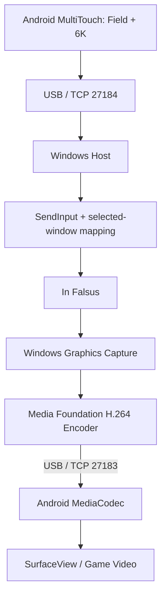

# InFalsusTouch

通过 USB 数据线把 Android 手机变成专用于 PC 音游 **In Falsus** 的横屏触控控制器。
Windows 使用 C++20 / Win32，Android 使用 Flutter Material 3 界面，触控与视频保留 Kotlin 原生处理。

**当前里程碑：带设置与校准的 USB 控制器原型。** 已实现 6K、多指 Hold、Field 绝对/相对控制、
独立输入通道，以及 WGC → GPU NV12 → 硬件 H.264 → Android MediaCodec / SurfaceView。
真机验证覆盖了游戏视频、同时输入、按下反馈和断开重连；USB Shift＋Space 已启动实际游戏教程。
Field 的游戏内绝对位置对齐、物理手指游玩仍待验收。
完整状态和性能测量边界见 [STATUS](docs/STATUS.md)。

最终交付为 `InFalsusTouchHost.exe` 和 `InFalsusTouch.apk`。输入优先级高于视频；
视频与控制分别使用独立线程和 TCP 端口，背压不会让输入等待编码完成。

## Requirements

运行端：

- Windows 11、Windows Graphics Capture、同一 GPU 上支持 D3D11 的硬件 H.264 编码器。
- Android 8.0 / API 26 以上，支持多点触控的手机。六押加 Field 需要至少七个同时触点；
  实际触点上限取决于硬件。
- USB 数据线、USB Debugging、已授权的 ADB，经 USB 承载 localhost TCP。
- Android 硬件 H.264 解码器需支持所选分辨率和帧率；不静默切换到软件编解码。
- 默认六轨键位为 Left Shift / A / S / D / F / Space；Host 只读同步 IF 保存的键盘绑定。
- 为游戏窗口选择 **英语（美国）键盘**。中文输入法的英文输入模式仍可能被 Shift 轨道切回中文；
  Host 启动时显示游戏线程的键盘布局，并对中日韩输入法布局提示。
- Host 与游戏应以相同权限等级运行；Windows 的输入隔离可能阻止低权限进程向高权限游戏注入。

构建端：

- Visual Studio 2022 Build Tools：Desktop development with C++、Windows SDK、CMake。
- JDK 17 或 21；Gradle 8.11.1、Android Gradle Plugin 8.9.2、Kotlin 2.1.20。
- Android SDK Platform 35、Build Tools 35.0.0、platform-tools。
- Flutter 3.44.x / Dart 3.12.x；首次运行 `flutter pub get` 准备依赖，构建脚本使用离线缓存。
- TCP 集成测试使用 `uv` 管理的 Python 3.13，仅依赖标准库。

## Build and test

在仓库根目录的 PowerShell 中运行：

```powershell
# 可选：现有 Android SDK 用户可直接在 android/local.properties 设置 sdk.dir。
# 此命令接受 Android SDK 许可，把工具安装到项目内 .tools；不改系统安装。
.\scripts\bootstrap-android.ps1 -AcceptAndroidSdkLicense

.\scripts\build-windows.ps1
.\scripts\build-android.ps1
uv run --python 3.13 tests\tcp-integration.py --host dist\InFalsusTouchHost.exe
uv run --python 3.13 tests\multiplayer-integration.py

# 可选真机验证：安装本项目 app 和测试 APK，使用 dry-run Host，不注入桌面按键。
.\scripts\test-device.ps1

# 可选视频验证：短暂显示项目自己的 Direct3D 测试窗口，不调用 SendInput。
uv run --python 3.13 tests\video-integration.py
.\scripts\build-android.ps1 -DeviceTests
uv run --python 3.13 tests\video-device.py
uv run --python 3.13 tests\multiplayer-video.py
```

Windows 脚本构建 Release 并运行 CTest。Android 脚本运行 Flutter 分析、界面测试、Kotlin 测试，构建 debug APK
并运行 lint。先构建 Windows 时，Android 测试会额外启动真实 Host 的 dry-run 模式，
验证 Kotlin/C++ 握手、六押、Field、断线释放与重连。

产物在 `dist/InFalsusTouchHost.exe`、`dist/InFalsusTouch.apk`。APK 使用开发签名，
尚非正式发行包。SDK、依赖缓存、临时套接字和构建输出均被 Git 忽略。

也可用 Android Studio 打开 `android/`，或运行 `android/gradlew.bat`。
构建脚本为打包式 Windows 启动环境设置项目内 Java 临时套接字目录；只对当前进程生效。
原生工具成功与否以退出码为准，不以是否输出 stderr 为准。

## Quick Start

1. 手机启用开发者选项与 **USB Debugging**，使用 USB 数据线连接 PC，确认手机上的授权提示。
2. 用 `adb devices -l` 检查状态。设备必须为 `device`，不能是 `unauthorized`。
3. 单台运行 `scripts/setup-adb.ps1`；多台运行 `scripts/setup-adb.ps1 -AllDevices -Install`。`-Serial` 可指定一台，`-AdbPath` 可指定 ADB。
4. 安装 `dist/InFalsusTouch.apk`，例如 `adb -d install -r .\dist\InFalsusTouch.apk`。
5. 启动 In Falsus，然后运行 `dist/InFalsusTouchHost.exe`。
6. Host 优先匹配标题中的 `In Falsus`；没有唯一匹配时显示窗口列表供选择。
7. 打开 Android App，点击 **连接 USB / Connect USB**，切回 PC 游戏窗口，再开始触摸。
8. 手机通过设置调节布局、按键显示和语言；工具栏隐藏后点侧边菜单打开。关闭 Host 用 Ctrl+C；App 后台运行时会断连并释放。

脚本建立：

```text
adb reverse tcp:27183 tcp:27183    Video
adb reverse tcp:27184 tcp:27184    Control/Input
```

Host 默认监听两个 loopback 端口。设备重新插拔或 ADB 重启后重新执行脚本。
Android 固定连接 `127.0.0.1`，不提供 Wi-Fi Host 地址设置。

视频默认 720p60 / 8 Mbps / H.264 Baseline / 半秒 GOP。只捕获所选窗口客户区，
按原比例缩放并补黑边；手机默认 Fit 与 Aligned Field + Floor。Fit 将完整画面居中显示，
软件界面铺满屏幕，游戏画面独立按比例居中，保留读谱区域。2400 × 1080 手机显示 16:9 游戏时左右各留 240 像素；
强行等比铺满会裁去上下画面，因此裁切只作为可选项。

默认启用 **Prefer 120 Hz display**，请求手机高刷新率；系统和省电设置决定实际结果。
这与 60 FPS 视频独立，统计分别显示屏幕 Hz 和视频 FPS。关闭后交回系统选择，不强制锁定 60 Hz。

```powershell
.\dist\InFalsusTouchHost.exe --video-diagnostics
.\dist\InFalsusTouchHost.exe --resolution 1080p --fps 60 --bitrate 12000000
.\dist\InFalsusTouchHost.exe --no-video
```

Host 显示实际 WGC / GPU / 编码器诊断。支持 `MinUpdateInterval` 的 Windows 会由 Host
统一控制取帧节奏，避免 165 Hz 屏幕被 WGC 的默认间隔限制到约 55 FPS。
旧版系统、源窗口刷新率和 GPU 负载仍可能影响实际 FPS。视频断连会单独重试；
输入默认手动 Connect；设置中启用 **Find USB Host automatically** 后，会在前台自动连接和重试，
不重放旧 Hold。主动 Disconnect 会停止重试，直到再次连接或重新打开 App。

## Settings and saved profiles

设置使用 Material 3 深色界面，支持 English / 中文即时切换并保存。每台手机在“按键显示”中
独立选择六个按钮和 Field，支持全部、仅按键、仅 Field、只看画面。隐藏按钮关闭对应触区，
选择部分按钮时按原编号顺序居中排列，保留宽度和形状，触区同步移动；全部六键时保留原轨道布局。
仅 Field 时扩大滑动区域。选择不会改变其他设备，也不要求合计覆盖七项操作。

手机 Settings 支持 Absolute / Relative、Aligned / Overlay / Reserved、Fit / Stretch / Crop，以及按键高度、
透明度、间距、亮度、编号、Field 范围和调试统计。配置在本机保存，重启后恢复。
主画面只保留小设置入口，边距一致。第一次点击使用 Android 系统 Toast 提示“再按一下进入设置”，2 秒内再次点击进入设置。
USB 连接、断开和日志合在「连接」页的 USB 卡片中，自动寻找独立显示；未连接时默认打开此页。性能统计默认关闭。

Aligned 布局以真实画面定位上方 Field、中央 A/S/D/F 和两侧 Shift/Space，
触区随视频缩放移动，黑边不接受游戏触摸。**Button touch height** 默认 40%，可调 10–50%；
向上增大按钮不会移动游戏判定线。Field 在按钮上方只处理水平移动。
按下时本地立即填色并点亮对应判定线，多指同键保持到最后一指抬起。
**Align game judgment lines** 提供六点校准，适配不同的游戏画面位置。

PC 视频质量与 Field 参数可以保存为默认配置：

```powershell
.\dist\InFalsusTouchHost.exe --resolution 1080p --fps 60 --bitrate 12000000 --save-profile
.\dist\InFalsusTouchHost.exe
```

默认文件为 `%LOCALAPPDATA%\InFalsusTouch\host.ini`。`--profile PATH` 选择其他配置；
显式命令行参数始终覆盖保存值，`--no-profile` 只在本次运行忽略配置。损坏配置会报错，
不会静默覆盖。详见 [SETTINGS.md](docs/SETTINGS.md)。

## Cooperative play and key sync

一个 Host 最多接受七台手机，同玩 PC 上的一局；电脑键盘和鼠标也可以参与。
多个设备按同一个键时，Host 合并长按，最后一个持有者松手才抬键。断线、超时或打开设置
只释放该设备自己的输入。多个设备显示 Field 时，先触摸者控制，松手后交给等待中的设备；
等待期间本地 Field 标记使用暖色。所有手机共用一次窗口采集和硬件编码，慢视频接收端单独断开重试。

Host 默认监测 `%USERPROFILE%\AppData\LocalLow\lowiro\infalsus\userV2.prefs`，
同步六轨按键名称和物理扫描码。文件只读，不修改存档。保存的键位改变后先释放旧按键，
再向手机发送新绑定，需重新按下才继续输入。当前支持已观察到的 `keybind_state=0`
键盘绑定；未知键或其他绑定状态会明确暂停输入，避免猜测后发送错键。
`--bindings PATH` 可指定配置位置，`--no-key-sync` 可使用默认键位。

新输入协议为 v2，Host 与 APK 必须一起更新；v1 客户端会被拒绝。

## Window and Field calibration

```powershell
.\dist\InFalsusTouchHost.exe --list
.\dist\InFalsusTouchHost.exe --window 0x123456
.\dist\InFalsusTouchHost.exe --title "In Falsus" --field-left 0.05 --field-right 0.95 --field-y 0.5
.\dist\InFalsusTouchHost.exe --sensitivity 1 --acceleration 0 --smoothing 0 --max-speed 12000
.\dist\InFalsusTouchHost.exe --calibrate
```

`--window` 的句柄必须使用本次 `--list` 的实际值。Field 坐标相对于所选窗口客户区；
Host 负责 DPI 与多显示器坐标转换。`max-speed` 单位为像素/秒，`smoothing` 范围为 `[0,1)`。
Relative 最终还会受游戏灵敏度及 Windows 相对输入处理影响。Absolute 保留为默认目标，
但当前游戏教程实测会锁定系统光标，默认坐标范围不能覆盖整个 Field；暂不能声称触点与游戏光标一一对应。

PC 校准时，让游戏窗口与 Host 控制台同时可见、保持控制台焦点，把鼠标移到游戏 Field 的
左端、右端和固定高度，各按一次 Enter；输入 `q` 取消。校准完成后保存并退出，重新启动 Host 生效。
手机的 **Calibrate phone Field area** 用于固定布局；Aligned 使用六点判定线校准。
判定线校准只调整手机触区，不能替代游戏内 Field 光标行程验证。
设置和校准期间会释放触点，视频继续播放；关闭后需重新按下才能控制游戏。

Host 仅在目标窗口处于前台时接受游戏输入。切换到其他窗口会释放所有按键；
返回游戏后必须抬起旧触点再按下。失焦不会把旧 Hold 自动重放到新窗口。

## Architecture



- [ARCHITECTURE.md](ARCHITECTURE.md)：模块职责、线程边界、资源生命周期与阶段门槛。
- [INPUT_PROTOCOL.md](protocol/INPUT_PROTOCOL.md)：32 字节输入协议、握手、ACK、超时与重连。
- [VIDEO_PROTOCOL.md](protocol/VIDEO_PROTOCOL.md)：视频分帧、时间戳、队列上限与 IDR 恢复。
- [requirements.md](docs/requirements.md)：原始完整需求。
- [manual-acceptance.md](tests/manual-acceptance.md)：真机和游戏验收清单。

## Validation boundaries

常规自动化测试使用 dry-run sink；单独的 native-input/game-input/game-field 验收工具会向指定前台窗口注入实际输入。
真机测试中的 MotionEvent 是合成事件；物理触点数量、完整谱面输入准确性仍需游玩验收。
手机显示的 RTT 是控制协议往返测量，不是玻璃到玻璃延迟。
视频统计分别显示接收/解码/呈现 FPS、码率、丢帧、队列，以及 PC 和手机的局部阶段耗时。
两端时钟未经同步，不能把它们直接相减。呈现回调也不能证明物理屏幕的发光时刻。

正常断开连接会立即清理被 Host 记录为按下的键。USB 拔线但 TCP 未及时报告 EOF 时，
Host 最多等待约 500 ms 心跳超时加系统调度开销后释放。强制杀进程或系统崩溃不保证执行清理。
协议 v2 信任本机及已授权 USB 调试设备；loopback 上没有另外的身份认证。
