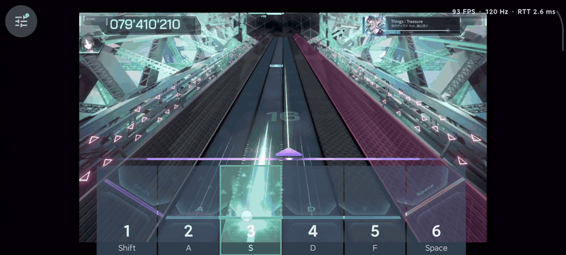

# InFalsusTouch

把 Android 手机或平板变成 **In Falsus 的触控手台**。通过 USB 连接电脑，在手机上看谱，用手指滑动 Field、点按或长按六键。

[下载预览版](https://github.com/Cedarflake/InFalsusTouch/releases/tag/v0.5.0-preview.2) · [设置说明](docs/SETTINGS.md) · [开发指南](docs/DEVELOPMENT.md)

*10 秒实机录屏节选，GIF 以 25 FPS 展示。*

这是一个非官方触控控制器，为游戏提供一种可选玩法。游戏在电脑上运行，声音也由电脑播放。

## 能做什么

- **触屏操作**：支持多指、长按和 Field 滑动，按键有按下反馈，也可开启震动。
- **按习惯调整**：同步游戏键位名称，可将按键对齐轨道、调整触区和校准判定线。
- **合作游玩**：最多连接 7 台设备，各自选择要显示的按键和 Field，分工操作同一局；电脑键鼠也能参与。
- **独立画面设置**：每台设备可选 60／90／120 FPS，默认完整、居中显示游戏画面。支持中英切换、深浅主题，设置自动保存。

## 安装与使用

需要 Windows 11、Android 8.0 或更新版本，以及支持数据传输的 USB 线。电脑和手机需要支持 H.264 硬件编解码。

1. 下载同一版本的 Android APK 和 Windows x64 压缩包，将 APK 安装到手机，完整解压 Windows 压缩包。
2. 手机开启开发者选项和 USB 调试，连接电脑，在手机上确认调试授权。
3. 电脑打开 In Falsus，再运行 `InFalsusTouchHost.exe`。如出现窗口列表，选择游戏。
4. 打开手机应用，连续点两次左上角设置按钮，在“连接”中点击“连接 USB”，随后返回游玩界面。
5. 将电脑焦点切回游戏。建议使用**英语（美国）键盘布局**，避免 Shift 触发中文输入法切换。

请保留 Windows 压缩包内的 `platform-tools` 文件夹，Host 会自动处理 USB 连接。多台设备分别连接后，在各自的“按键显示”中选择要负责的操作即可。

## 预览版须知

当前版本为 **v0.5.0-preview.2**。更新时请同时替换手机 APK 和电脑 Host。

- 选择 120 FPS 不代表始终能呈现 120 帧，实际表现取决于游戏供帧、手机刷新率和运行负载。
- 系统三指截屏等快捷手势可能中断多指输入，应用暂时无法绕过。是否关闭由用户自行决定。
- Field 默认使用相对移动，灵敏度在游戏里调整。实验性绝对定位目前仅适配已验证的 In Falsus 1.0.4b。
- 多设备加入、断开和帧率切换已通过模拟回归，真实多机协作的体验仍需更多验证。
- 暂不向手机传输声音；性能统计中的 RTT 也不代表触控到画面的完整延迟。

曾安装开发签名 APK 的设备无法直接覆盖安装此发布签名版本；请先记录设置，再自行卸载旧包并安装。卸载会清除应用设置。后续发行版将沿用同一发布签名。

使用与校准见 [设置说明](docs/SETTINGS.md)。参与开发可从 [开发指南](docs/DEVELOPMENT.md) 和 [架构说明](ARCHITECTURE.md) 开始。
