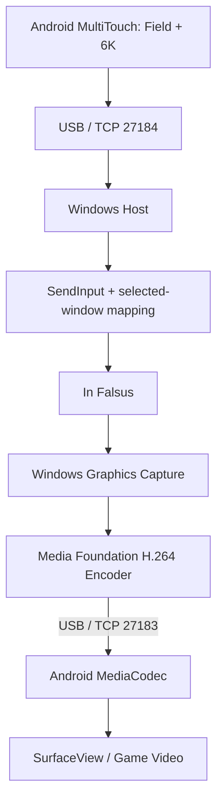

# InFalsusTouch

通过 USB 数据线把 Android 手机变成专用于 PC 音游 **In Falsus** 的横屏触控控制器。
Windows 使用 C++20 / Win32，Android 使用 Kotlin / 原生 `MotionEvent`。

**当前里程碑：输入与 USB 硬件视频原型。** 已实现 6K、多指 Hold、Field 绝对/相对控制、
独立输入通道，以及 WGC → GPU NV12 → 硬件 H.264 → Android MediaCodec / SurfaceView。
真机验证覆盖了视频像素、同时输入和断开重连；In Falsus 实际游玩仍待验收。
完整状态和性能测量边界见 [STATUS](docs/STATUS.md)。

最终交付为 `InFalsusTouchHost.exe` 和 `InFalsusTouch.apk`。输入优先级高于视频；
视频与控制分别使用独立线程和 TCP 端口，背压不会让输入等待编码完成。

## Requirements

运行端：

- Windows 11、Windows Graphics Capture、同一 GPU 上支持 D3D11 的硬件 H.264 编码器。
- Android 8.0 / API 26 以上，支持多点触控的手机。六押加 Field 需要至少七个同时触点；
  实际触点上限取决于硬件。
- USB 数据线、USB Debugging、已授权的 ADB，经 USB 承载 localhost TCP。
- Android 硬件 H.264 解码器需支持所选分辨率和帧率；不静默切换到软件编解码。
- In Falsus 的六轨键位为 Left Shift / A / S / D / F / Space。
- Host 与游戏应以相同权限等级运行；Windows 的输入隔离可能阻止低权限进程向高权限游戏注入。

构建端：

- Visual Studio 2022 Build Tools：Desktop development with C++、Windows SDK、CMake。
- JDK 17 或 21；Gradle 8.11.1、Android Gradle Plugin 8.9.2、Kotlin 2.1.20。
- Android SDK Platform 35、Build Tools 35.0.0、platform-tools。
- TCP 集成测试使用 `uv` 管理的 Python 3.13，仅依赖标准库。

## Build and test

在仓库根目录的 PowerShell 中运行：

```powershell
# 可选：现有 Android SDK 用户可直接在 android/local.properties 设置 sdk.dir。
# 此命令接受 Android SDK 许可，把工具安装到项目内 .tools；不改系统安装。
.\scripts\bootstrap-android.ps1 -AcceptAndroidSdkLicense

.\scripts\build-windows.ps1
.\scripts\build-android.ps1
uv run --python 3.13 tests\tcp-integration.py --host dist\InFalsusTouchHost.exe

# 可选真机验证：安装本项目 app 和测试 APK，使用 dry-run Host，不注入桌面按键。
.\scripts\test-device.ps1

# 可选视频验证：短暂显示项目自己的 Direct3D 测试窗口，不调用 SendInput。
uv run --python 3.13 tests\video-integration.py
.\scripts\build-android.ps1 -DeviceTests
uv run --python 3.13 tests\video-device.py
```

Windows 脚本构建 Release 并运行 CTest。Android 脚本运行 Kotlin 测试、构建 debug APK
并运行 lint。先构建 Windows 时，Android 测试会额外启动真实 Host 的 dry-run 模式，
验证 Kotlin/C++ 握手、六押、Field、断线释放与重连。

产物在 `dist/InFalsusTouchHost.exe`、`dist/InFalsusTouch.apk`。APK 使用开发签名，
尚非正式发行包。SDK、依赖缓存、临时套接字和构建输出均被 Git 忽略。

也可用 Android Studio 打开 `android/`，或运行 `android/gradlew.bat`。
构建脚本为打包式 Windows 启动环境设置项目内 Java 临时套接字目录；只对当前进程生效。
原生工具成功与否以退出码为准，不以是否输出 stderr 为准。

## Quick Start

1. 手机启用开发者选项与 **USB Debugging**，使用 USB 数据线连接 PC，确认手机上的授权提示。
2. 用 `adb devices -l` 检查状态。设备必须为 `device`，不能是 `unauthorized`。
3. 只连接一台 USB 手机，运行 `scripts/setup-adb.ps1`。`-Serial` 可额外核对设备；ADB 不在 PATH 时可传 `-AdbPath`。
4. 安装 `dist/InFalsusTouch.apk`，例如 `adb -d install -r .\dist\InFalsusTouch.apk`。
5. 启动 In Falsus，然后运行 `dist/InFalsusTouchHost.exe`。
6. Host 优先匹配标题中的 `In Falsus`；没有唯一匹配时显示窗口列表供选择。
7. 打开 Android App，点击 **Connect**，切回 PC 游戏窗口，再开始触摸。
8. 切换 Field Absolute / Relative 可用手机顶部按钮。关闭 Host 用 Ctrl+C；App 后台运行时会断连并释放。

脚本建立：

```text
adb reverse tcp:27183 tcp:27183    Video
adb reverse tcp:27184 tcp:27184    Control/Input
```

Host 默认监听两个 loopback 端口。设备重新插拔或 ADB 重启后重新执行脚本。
Android 固定连接 `127.0.0.1`，不提供 Wi-Fi Host 地址设置。

视频默认 720p60 / 8 Mbps / H.264 Baseline / 半秒 GOP。只捕获所选窗口客户区，
按原比例缩放并补黑边；手机默认 Fit 与半透明 Overlay。

```powershell
.\dist\InFalsusTouchHost.exe --video-diagnostics
.\dist\InFalsusTouchHost.exe --resolution 1080p --fps 60 --bitrate 12000000
.\dist\InFalsusTouchHost.exe --no-video
```

Host 显示实际 WGC / GPU / 编码器诊断。支持 `MinUpdateInterval` 的 Windows 会由 Host
统一控制取帧节奏，避免 165 Hz 屏幕被 WGC 的默认间隔限制到约 55 FPS。
旧版系统、源窗口刷新率和 GPU 负载仍可能影响实际 FPS。视频断连会单独重试；
输入断连需要重新 Connect，不重放旧 Hold。

## Window and Field calibration

```powershell
.\dist\InFalsusTouchHost.exe --list
.\dist\InFalsusTouchHost.exe --window 0x123456
.\dist\InFalsusTouchHost.exe --title "In Falsus" --field-left 0.05 --field-right 0.95 --field-y 0.5
.\dist\InFalsusTouchHost.exe --sensitivity 1 --acceleration 0 --smoothing 0 --max-speed 12000
```

`--window` 的句柄必须使用本次 `--list` 的实际值。Field 坐标相对于所选窗口客户区；
Host 负责 DPI 与多显示器坐标转换。`max-speed` 单位为像素/秒，`smoothing` 范围为 `[0,1)`。
Relative 最终还会受 Windows 相对鼠标输入处理影响，默认推荐 Absolute。

Host 仅在目标窗口处于前台时接受游戏输入。切换到其他窗口会释放所有按键；
返回游戏后必须抬起旧触点再按下。失焦不会把旧 Hold 自动重放到新窗口。

## Architecture



- [ARCHITECTURE.md](ARCHITECTURE.md)：模块职责、线程边界、资源生命周期与阶段门槛。
- [INPUT_PROTOCOL.md](protocol/INPUT_PROTOCOL.md)：32 字节输入协议、握手、ACK、超时与重连。
- [VIDEO_PROTOCOL.md](protocol/VIDEO_PROTOCOL.md)：视频分帧、时间戳、队列上限与 IDR 恢复。
- [requirements.md](docs/requirements.md)：原始完整需求。
- [manual-acceptance.md](tests/manual-acceptance.md)：真机和游戏验收清单。

## Validation boundaries

自动化测试使用 dry-run sink，验证输入决策和网络行为，不向桌面注入实际按键。
真机测试中的 MotionEvent 是合成事件；物理触点数量、游戏对 SendInput 的接受情况仍需游玩验收。
手机显示的 RTT 是控制协议往返测量，不是玻璃到玻璃延迟。
视频统计分别显示接收/解码/呈现 FPS、码率、丢帧、队列，以及 PC 和手机的局部阶段耗时。
两端时钟未经同步，不能把它们直接相减。呈现回调也不能证明物理屏幕的发光时刻。

正常断开连接会立即清理被 Host 记录为按下的键。USB 拔线但 TCP 未及时报告 EOF 时，
Host 最多等待约 500 ms 心跳超时加系统调度开销后释放。强制杀进程或系统崩溃不保证执行清理。
协议 v1 信任本机及已授权 USB 调试设备；loopback 上没有另外的身份认证。
